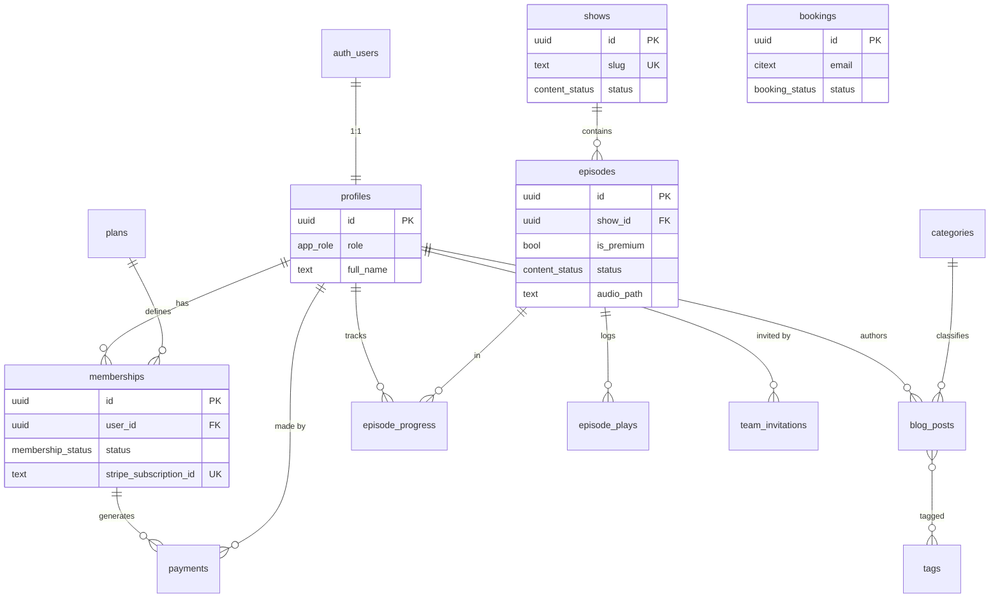

# 02 — Database Schema (Supabase / PostgreSQL)

> **Project:** `erwin-natividad-2026`
> **Migration:** `supabase/migrations/0001_initial_schema.sql`
> **Engine:** Supabase (PostgreSQL 15+, Auth, Storage)

This document is the human-readable companion to the migration. It explains the model, the relationships, and — most importantly for a Platform-tier build — the **security model**, since this site holds member accounts, payment records, and gated premium content.

---

## 1. Design principles

1. **RLS on everything.** Row Level Security is enabled on every table. The database is the enforcement boundary, not the API layer — a leaked or misused anon key still can't read what a user shouldn't see.
2. **Roles drive access.** A single `app_role` enum (`member < viewer < editor < admin < owner`) governs both the public-facing membership tier and the staff hierarchy. Checks run through `SECURITY DEFINER` helper functions, which read `profiles` while bypassing RLS — this is the standard way to avoid the recursive-policy footgun where a policy on `profiles` would need to query `profiles`.
3. **Stripe is the source of truth for money.** `plans`, `memberships`, and `payments` are written **only by the service role** via Stripe webhooks. There are no client insert/update policies on them — clients can read their own rows and that's it. This prevents a user from ever granting themselves a membership.
4. **Premium audio never leaks.** Episodes store a Storage *path*, not a public URL. The playable URL is a short-lived signed URL minted server-side only after the same membership check the RLS policy enforces.
5. **Public can contribute, staff can read.** Bookings, newsletter signups, and episode plays accept anonymous inserts (anyone can book a call or subscribe) but are readable only by staff.

---

## 2. Role & access tiers

| Role | Tier | Granted by |
|---|---|---|
| `member` | Public account holder; premium access if subscribed | Self-signup (default) |
| `viewer` | Staff, read-only admin | Invite |
| `editor` | Staff, manages content & bookings | Invite |
| `admin` | Staff, full ops + members/payments/settings/team | Invite by owner |
| `owner` | Erwin — everything, assigns admins, transfers ownership | Bootstrap (manual `update`) |

A user **cannot escalate their own role**: the `profiles` self-update policy forces the new `role` to equal the stored one. Promotions go through admin/owner policies. Note: restricting *who can grant admin/owner specifically* (only owner) is enforced at the server/RPC layer rather than in raw RLS, to keep the policy set readable — flagged in §6.

---

## 3. Entity relationship diagram



---

## 4. Entities at a glance

| Table | Purpose | Who writes | Who reads |
|---|---|---|---|
| `profiles` | One row per auth user; holds role + display info | Self (not role); admin (role) | Self; staff (all) |
| `plans` | Stripe-backed membership/product catalog | Admin (catalog), service role | Public (active); staff (all) |
| `memberships` | A user's subscription state | **Service role only** (Stripe) | Own; admin |
| `payments` | Transaction log | **Service role only** (Stripe) | Own; admin |
| `shows` | Podcast shows | Editor+ | Public (published); staff (all) |
| `episodes` | Episodes, premium flag, audio path, transcript | Editor+ | Public (published, non-premium **or** active member); staff (all) |
| `categories` | Episode/blog categories (color-coded) | Editor+ | Public |
| `tags` | Blog tags | Editor+ | Public |
| `blog_posts` | Articles & show notes | Editor+ | Public (published); staff (all) |
| `blog_post_tags` | Post↔tag join | Editor+ | Public |
| `bookings` | Discovery-call / project leads | Public insert; editor+ manage | Staff |
| `newsletter_subscribers` | Email list, MailerLite mirror | Public insert; editor+ manage | Staff |
| `team_invitations` | Pending staff invites + tokens | Admin+ | Admin+ |
| `episode_progress` | Per-user resume position | Own | Own |
| `episode_plays` | Append-only play log (analytics) | Public insert | Staff |
| `settings` | Key/value site config | Admin+ | Public (flagged subset); staff (all) |

---

## 5. Notable design decisions

- **`profiles` extends `auth.users`.** A trigger (`on_auth_user_created`) auto-inserts a profile on signup, pulling `full_name`/`avatar_url` from auth metadata. New users default to `member`.
- **One active membership per user.** A partial unique index (`memberships_user_active_idx`) blocks duplicate active/trialing/past-due rows, so webhook retries can't create doubles.
- **Premium gating lives in one place.** The `episodes` read policy is the single decision point: published + (`is_premium = false` *or* `has_active_membership()`). The signed-URL endpoint reuses the same function, so policy and audio delivery can never drift apart.
- **`citext` for emails** on `bookings` and `newsletter_subscribers` — case-insensitive uniqueness without lowercasing in app code.
- **`episode_plays` is append-only `bigint identity`** — cheap to write on every play, indexed by `(episode_id, played_at)` for the dashboard's "top episodes" and trend charts.
- **`settings.is_public`** lets a small subset (site name, etc.) be read by the public site while keeping integration config staff-only.

---

## 6. Security model summary

| Layer | Mechanism |
|---|---|
| Authentication | Supabase Auth (email/password; OAuth optional later) |
| Authorization | `app_role` + `SECURITY DEFINER` helpers: `is_staff()`, `is_editor()`, `is_admin()`, `is_owner()`, `has_min_role()`, `has_active_membership()` |
| Data isolation | RLS on all 16 tables |
| Money | `plans`/`memberships`/`payments` are service-role-write-only; reachable from clients read-only |
| Premium media | Audio served as time-limited signed URLs after a server-side membership check; raw paths never exposed |
| Self-escalation | `profiles` update policy pins `role` to its stored value for self-updates |
| **Server-enforced (not RLS)** | Only `owner` may grant `admin`/`owner` or transfer ownership — enforced in the admin RPC/route, since expressing actor-vs-target rank comparison in RLS would hurt readability. Documented here so it isn't lost. |

### Storage buckets (configured at scaffolding, policies mirror the above)
| Bucket | Visibility | Notes |
|---|---|---|
| `episode-audio` | Private | Signed URLs only; gated by membership for premium |
| `episode-art` / `show-art` | Public | Cover images |
| `blog-media` | Public | Article images |
| `avatars` | Public | Member/staff avatars |

---

## 7. Applying the migration

```bash
# from project root, once the Supabase project exists (scaffolding step)
supabase db push                 # or: supabase migration up

# then promote Erwin to owner (one time)
# psql / SQL editor:
update public.profiles set role = 'owner' where id = '<erwin-auth-uid>';
```

The migration is idempotent-friendly where it matters (settings seed uses `on conflict do nothing`) but is intended to run once as the initial schema. Subsequent changes get their own numbered migration files.

---

## 8. What's next

This schema is what the **dev scaffolding** step wires up: a Supabase project gets created, this migration applied, the typed client generated (`supabase gen types typescript`), and the app routes from doc 01 connected to these tables. The existing responsive designs then drop onto those wired routes, and `/admin` becomes the role-gated shell over `episodes`, `shows`, `blog`, `bookings`, `subscribers`, `members`, `payments`, `team`, and `settings`.
